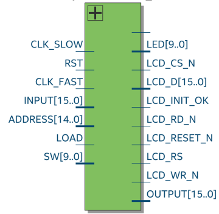

# Control Unit

Considerando a unidade de controle descrita a seguir (entradas e saídas), vamos projetar uma lógica (em VHDL) para resolver algumas saídas da entidade, o resto será feito no projeto.

{width=60%}

### (exemplo) `loadS`


O sinal `loadS` indica quando o registrador `S` deve armazenar um novo sinal. Para isso, devemos verificar se a instrução em questão que será decodificada pelo 'controlUnit' é do tipo **comando** (C), essa verificação é feita pelo bit mais significativo da instrução (bit17)

Uma vez que detectado uma instrução do tipo C, devemos verificar se o comando que ela representa carrega a operação de salvar em %S (bit 5/ d2).

Com esses dados conseguimos criar a tabela verdade a seguir e extrair as equações.

| bit 17 | bit 5 | loadS |
|--------|-------|-------|
|      0 |     X |     0 |
|      1 |     0 |     0 |
|      1 |     1 |     1 |

Podendo ser traduzido para o código em VHDL:

```vhd
loadS <= INSTRUCAO(17) and INSTRUCAO(5);
```

\newpage

### `loadM`

```

loadM <=


```

### `loadA`

```

loadA <=


```

### `zx`


```

zx <=


```

### `muxA/M`

```

muxAM <= 


```


<div class="alert">
  Valide as respostas com algum professor/ colega.
</div>


\newpage

# Memory IO 

O componente `memory IO` é a 'memória' do nosso computador. Interno nesse módulo possuímos além da memória RAM, outros componentes tais como: tela, chave, leds. Lembrando que para a CPU, não existe separação entre o que é memória e o que é hardware externo. 

Os periféricos internos do `memoryIO` são:

- Tela (`screen.vhd`)
    - responsável por controlar o LCD 
- RAM (`ram16k.vhd`)
    - memória RAM de 16k endereços
- SW
    - chaves da FPGA
- LED
    - LEDs da FPGA

`screen` e `ram16k` possuem a interface detalhada a seguir:


> os sinais do tipo **LCD_** da `screen` são conectados diretamente ao LCD, via portmap.

O componente `memoryIO` possui a seguinte entidade:



\newpage

## Estudando!

1. Pense e discuta com seus colegas o `memoryIO`.

2. Dos sinais de entrada do `memoryIO` qual define qual periférico será 'escrito/lido' pela CPU? Explique.

```


```

3. Qual sinal informa o `memoryIO` que a CPU está realizando uma escrita?

```


```

4. Como funciona o LCD? Quais são suas entradas e saídas (tirando tudo que começa com **LCD_**)

```


```


4. Como funciona o LED?

```


```

5. Faça um esboço (diagrama) de como o `memoryIO` implementará a saída `LED` 

```


         |                                                          |
   LOAD  --->                                                       |
   ADDRESS ->                                                       |
   INPUT --->                                                       |
         |                                                          ---> LED
         |                                                          |
         |                                                          |
         |                                                          |
         |                                                          |
         
         
     
     
     
```

Pinos do `memoryIO`:

- LOAD: indica escrita
- ADDRESS(16 downto 0): endereço da escrita
- INPUT(16 downto 0): dado a ser escrito 
- LED(9 downto 0): Valor dos LEDs da FPGA

\newpage


# CPU

Proponha uma modificação na `CPU` do nosso Z01.1 que:

 1. Adiciona mais um registrador (onde é melhor?)
 1. Possibilita %S endereçar a memória 
     - `movw %D, (%S)`
 1. Possibilite fazer carregamento efetivo em %D
     - `leaw $5, %D`

Faça o desenho da nova CPU.


\newpage

# Extras

### `nop`


### `movw %S, %D e jg %S`

Nossa CPU suportaria executar um `movw %S, %D` e ao mesmo tempo a instrução `jg %D`? 


### `loadPC`


```

loadPC <=


```


### Dissasembly

Você teve acesso a um binário de um programa para o Z01.1:
```
000000000000000101
100101100000010000
000000000000000001
100000000000100000
000000000000001011
100010011000000001
100001010100000000
100001111110100000
000000000000001100
100000011000000111
100001010100000000
100001010100100000
000000000000000000
100010011000001000
```

1. Faça o dissasembly (recuperar a instruções originais)
2. O que o código faz?

