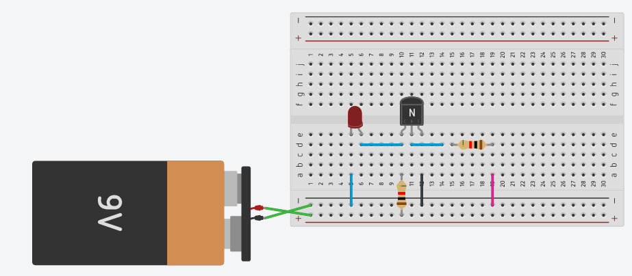

# Lab 3: Transistores

Esse laboratório tem como objetivo trabalhar com os conceitos básicos de portas lógicas do tipo RTL realizadas a base de transistores discretos do tipo BJT . Assim como desenvolver o trabalho em grupo via a fragmentação das atividades em módulos.

## Parte 1

!!! warning ""
    Realizar em duplas

1. Abra o site: http://www.falstad.com/circuit/
1. :arrow_right: Arquivo :arrow_right: Importar Arquivo Texto :arrow_right: Copiar e colar o texto a seguir

!!! note ""
    ```
    $ 1 0.000005 10.20027730826997 52 5 50
    R 368 64 320 64 0 0 40 6 0 0 0.5
    g 368 432 368 496 0
    t 320 208 368 208 0 1 -2.4273420612275154 0.6036514634436996 100
    w 368 160 368 192 0
    t 320 256 368 256 0 1 0.5145133301062574 0.6054914059129475 100
    w 368 224 368 240 0
    w 368 272 368 288 0
    w 368 368 368 384 0
    r 320 208 240 208 0 2000
    r 240 256 320 256 0 2000
    L 240 208 208 208 0 1 false 3.6 0
    L 240 256 208 256 0 1 false 3.6 0
    r 368 288 368 368 0 2000
    r 368 288 448 288 0 2000
    t 448 288 496 288 0 1 -3.1219716002696054 -0.07756831971486333 100
    t 448 368 496 368 0 1 -5.999999999780089 -2.9555967192253467 100
    w 448 368 320 368 0
    r 320 368 224 368 0 2000
    w 496 272 496 160 0
    w 496 160 368 160 0
    w 368 160 368 64 0
    w 496 352 544 352 0
    w 544 352 544 160 0
    w 544 160 496 160 0
    w 496 304 576 304 0
    w 496 384 576 384 0
    w 576 384 576 304 0
    r 576 400 576 464 0 1000
    w 368 432 368 384 0
    g 576 448 576 496 0
    M 576 384 640 384 0 2.5
    L 224 368 208 368 0 0 false 5 0
    w 576 400 576 384 0
    ```

Vocês devem obter o seguinte diagrama:

{width=400}

!!! example "Tarefa"
    - Encontre a tabela verdade do circuito 
    - Encontrar a equação lógica
    - Desenhar o diagrama da equação (simplificado)

!!! tip "Simulação"
    Existem basicamente três níveis de simulação: a primeira, puramente lógica utiliza de portas lógicas "ideais" (https://simulator.io/board). Um simulador mais preciso irá utilizar transistores para a implementação dessas portas lógicas porém não leva em consideração todos os fatores físicos-eletrônicos dos componentes (http://falstad.com/circuit/). Já um simulador que leva em consideração as propriedades dos componentes é chamado de SPICE e irá gerar uma simulação mais precisa em termos físicos do circuito original (http://circuitlab.com).

## Parte 2

Implementando porta lógicas com transistores BJT.

### Material

Cada grupo receberá:

- Duas protoboards
- Duas baterias 9V
- Jumpers macho-macho
- 12 transistores [BJT-N BC337](https://www.onsemi.com/pub/Collateral/BC337-D.PDF)
- 24 resistores de 2k
- 6 LEDs coloridos (Vermelho, amarelo e verde)


## Trabalhando

!!! warning 
    Todos do grupo devem participar!

O grupo deve se organizar e executar da melhor forma possível (com todos participando) os módulos a seguir, utilizando:

- Entradas: Utilizar como entrada do sistema (A,B,C,...) **jumpers** que estarão hora conectados em **GND (0)** ou **VCC (1)**. 
- Saídas: A saída final do sistema deve ser representada com um LED, sendo aceso indicando lógica `1` e apagado lógica `0`.
- Validação: Uma tabela verdade do circuito deve ser apresentada e em aula demonstrado que o circuito representa a tabela.

### 1a - NOT

**Cada grupo deve realizar duas** implementações do circuito a seguir que representa uma NOT:


!!! tip
    Utilize o [datasheet](https://www.onsemi.com/pub/Collateral/BC337-D.PDF) do transistor para entender a montagem

A imagem é uma ilustração do que vocês devem montar, utilizem como referência.



!!! warning
    Se você perceber que algum transistor está aquecendo,
    desconecte a bateria e verifique novamente a montagem.
    Isso é um sinal que alguma coisa está errada.

!!! example "Tarefa"
    Levante a tabela verdade do circuito recém montado, é uma `not`?

!!! tip
    O fio 'rosa' da imagem anterior representa a entrada do seu circuito, você deve colocar ela em `GND` para simular uma entrada `0` e em `VCC` para simular uma entrada `1`.


    
### 1b - NOT NOT

Agora que as duas `NOT` foram implementadas, testadas e estão funcionado, conecte a saída de uma na entrada da outra. Isso vai fazer com que a saída siga o valor de referência da entrada.

{width=300}

!!! example "Exercício 1b"
    Levante a tabela verdade do circuito recém montado

!!! example "Tarefa"
    1. Levante a tabela verdade do circuito recém montado.
    1. Qual porta lógica é essa?

### 2 - Equação

Implemente de forma a equação lógica a seguir em um circuito do tipo RTL. 

```
   Q = A.(A.(A+B)+A.C)
```

!!! warning 
    Vocês devem conseguir paralelizar a execução dessa equação, para isso divida o grupo e cada um faz uma parte da equação, depois junte tudo!

!!! tip
    1. Da para simplificar?
    1. Antes de montar, faça o diagrama de blocos!
    1. Simular é sempre bem vindo.


!!! example "Tarefa"
    Levante a tabela verdade do circuito recém montado

    
## Referências

A página: [http://hyperphysics.phy-astr.gsu.edu/hbase/Electronic/trangate.html#c4](http://hyperphysics.phy-astr.gsu.edu/hbase/Electronic/trangate.html#c4) possui exemplos de diversas portas lógicas que podem ser implementadas via RTL. Já o site [https://www.electronics-tutorials.ws/logic/logic_1.html](https://www.electronics-tutorials.ws/logic/logic_1.html) possui uma parte teórica mais trabalhada.


