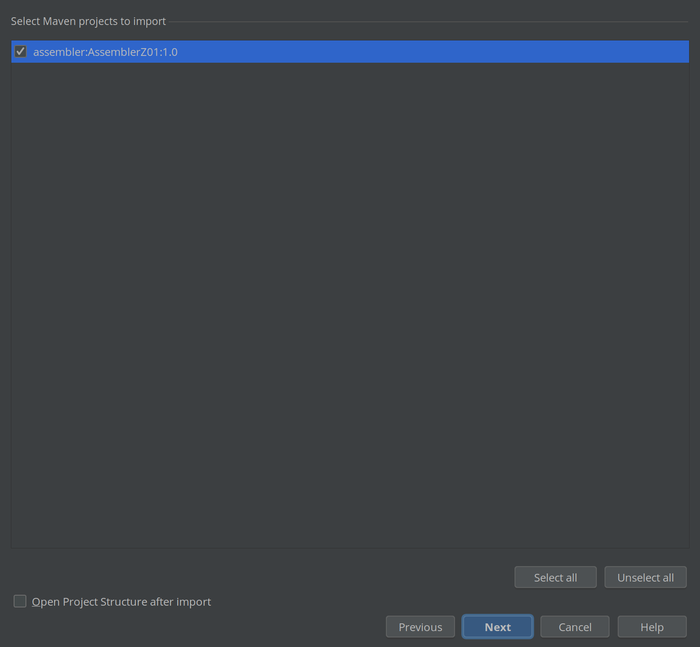
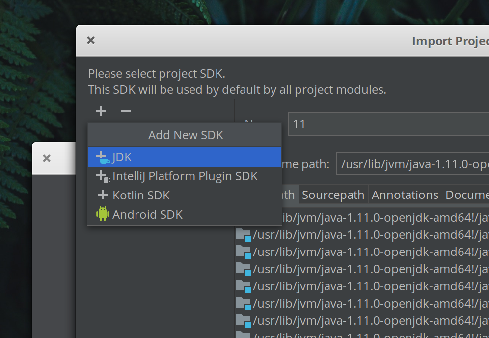
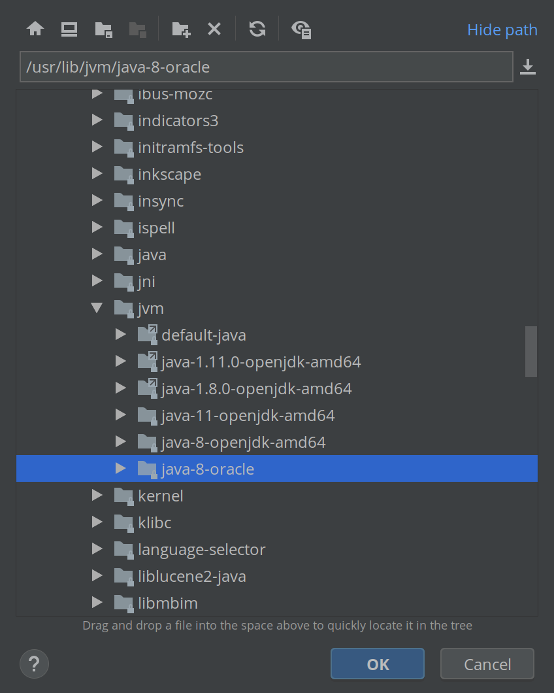
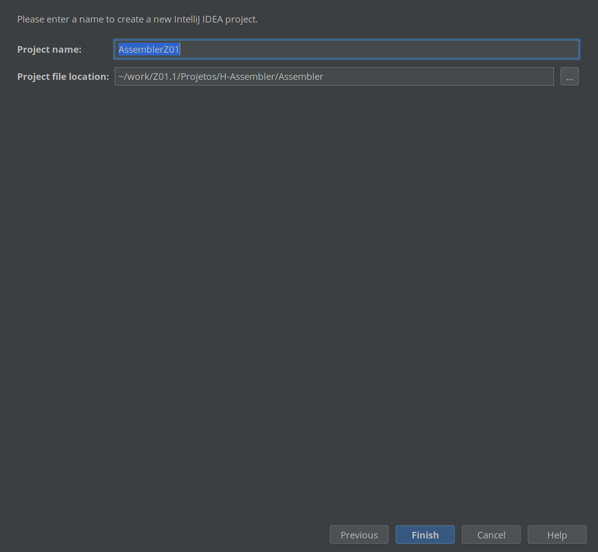

!!! warning
    Todos do grupo devem realizar de forma individual!

Iremos realizar o desenvolvimento do Assembler na IDE do Intellij, para isso precisamos importar um projeto do tipo maven.

- Com o [Intellij instalado](H-Assembler-Prerequisitos):

- Import Project:

- Importe a pasta do Projeto `H-Assebler/Assembler`:

- Escolha o `Maven`:

- Iremos trabalhar com o JDK 8 `java-8-oracle`. Será necessário adicionar o mesmo na ferramenta:

- O caminho normalmente é `/usr/lib/jvm/`

