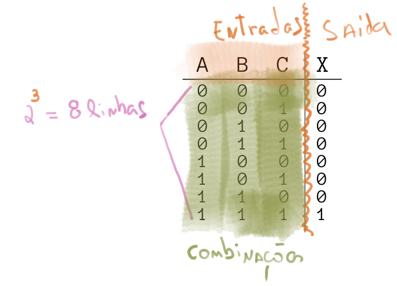

# Álgebra Booleana

| Estudando |    |
| --------- | -- |
| daw       |    |


A álgebra booleana foi desenvolvida por [George Boole](https://pt.wikipedia.org/wiki/George_Boole), um matemático britânico que desenvolveu os conceitos em 1847, base da computação moderna. Muito tempo depois, nos anos 30, Claude Shannon, um importante engenheiro na história da computação moderna, aplicou as ideias de Boole em circuitos elétricos. Ele trabalhava no Analisador Diferencial de Vannevar Bush, e logo percebeu a relação dos relés com álgebra booleana. Ele fazia um relé acionar o outro usando usando uma lógica binária do relé fechado ou aberto. Sua dissertação e artigos, levaram outras pessoas a perceber os benefícios da álgebra booleana em eletrônica e consequentemente computação.

Em Álgebra Booleana as variáveis só podem assumir dois valores. Desligado e ligado, ou falso e verdadeiro, 0 volt e 5 volts, branco e preto. Porém normalmente na computação usamos `0` e `1` pela conveniência. Todos os computadores tem como sua menor unidade de dado, esse elemento. Em computação chamamos isso de bit. quem vem dígito binário (ou do inglês binary digit).

## bit

Bit é a unidade mais simples de representação de dados digitais, um bit é uma unidade que pode assumir apenas dois valores: `0` ou `1`. Com um bit podemos representar o estado de uma luz na sala de aula, se uma cadeira está vazio ou não, .... não conseguimos representar **com apenas um bit** uma informação que não seja binária. Mas se combinarmos mais de um bit, criando um vetor de bits, somos capazes de representar quantos estados desejarmos.

<iframe width="710" height="520" src="https://www.youtube.com/embed/ewokFOSxabs" frameborder="0" allow="accelerometer; autoplay; encrypted-media; -picture" allowfullscreen></iframe>

## Equações


Uma equação de lógica booleana pode possuir zero ou mais 'entradas' e apenas uma saída, na equação exemplo a seguir, `X` é uma saída (e pode assumir apenas valor `1` ou `0`) e `A` e `B` são entradas também do tipo binária.

```
    X(A,B) = A ^ B
```

{width=400}

!!! note 
    A operação `^` é chamada de `E` (`and`) que também pode ser representada pelo simbolo de multiplicação escalar `.`
    
    X = A and B
    X = A . B

A operação de `and` pode ser entendida como uma multiplicação: A saída (`X`) só é verdadeira se as entradas `A` e `B` forem verdadeiras: `1 . 1 = 1`. Como A e B são números binários, é possível encontrar uma tabela que relaciona o valor da saída `X` com as possíveis entradas de `A` e `B`

| Entrada A | Entrada B | Saída X |
|-----------|-----------|---------|
| `0`       | `0`       | `0`     |
| `0`       | `1`       | `0`     |
| `1`       | `0`       | `0`     |
| `1`       | `1`       | `1`     |

!!! note "Tabela Verdade"
    Essa tabela que acabamos de construir chama tabela verdade, e será muito utilizada 
    ao longo do curso.
    
Podemos representar essa equação `X = A ^ B` como sendo um circuito digital, como ilustrado a seguir:

{width=400}


## Operações

O `and` utilizado no exemplo anterior é um operador da lógica booleana, operadores possuem uma ou mais entradas e geram uma saída. Os operadores mais comuns são: `not`, `and`, `or`, `nand`, `nor`, `xor`.

### not, and, or, nor


??? note "not"
    O operador `not` atua sobre uma variável, tornando a saída o inverso da entrada, ou seja, se a entrada do operador for `1` sua saída será `0` e vice versa.

    > Uso: a luz interna do carro será acesa ('1') quando a porta estiver fechada ('0').


    - Notação: `not`, `-`, `~`, `¬`

    ```
                                  _
    X = not A  /  X = A  /  X = Ã / X = ¬ A
    ```

    - Tabela Verdade

    | Entrada A | X  = not A |
    | --------- | ---------- |
    | `0`       | `1`        |
    | `1`       | `0`        |

    - Simbologia

    {width=300}

??? note "and"
      O operador `and` atua sobre duas variável, tornando a saída `verdadeira` somente se as duas entradas forem `verdadeiras`, se uma das entradas forem `falsa` a saída será `falsa`.

      > Uso: o cofre será aberto somente quando as duas chaves de seguranças forem inseridas.

      - Notação:  `and`, `.`, `^`

      ```
      X = A and B  /  X = A . B   /  X = A ^ B
      ```

      - Tabela Verdade

      | A   | B   | X = A and B |
      |-----|-----|-------------|
      | `0` | `0` | `0`         |
      | `0` | `1` | `0`         |
      | `1` | `0` | `0`         |
      | `1` | `1` | `1`         |

      - Simbologia

      {width=300}

??? note "or"

    O operador `or` atua sobre duas variável, tornando a saída `verdadeira` sempre que uma das entradas forem `verdadeira`.

    > Uso: O alarme de incêndio será acionado caso alguns dois dois botões sejam pressionados.  

    - Notação:  `or`, `+`, `v`

    ```
    X = A or B  /  X = A + B   /  X = A v B
    ```

    - Tabela Verdade

    | A   | B   | X = A or B |
    |-----|-----|------------|
    | `0` | `0` | `0`        |
    | `0` | `1` | `1`        |
    | `1` | `0` | `1`        |
    | `1` | `1` | `1`        |

    - Simbologia

    {width=300}

??? note "nand"

    Podemos começar a 'unir' operadores para formar novos comportamentos, o `nand` é a inversão (`not`) da porta lógica `and`. Na porta `nand` a saída só é `verdadeira` quando as entradas são `falsas`.

    > Uso: Soar o alarme se os sensores de batimento cardíaco e o de pressão falharem.  

    - Notação:  `nand`, `¬( ∧ )`

    ```
                        _____
    X = A nand B  /  X = A . B  / X = ¬(A ∧ B)
    ```

    - Tabela Verdade

    | A   | B   | X = A nand B |
    |-----|-----|--------------|
    | `0` | `0` | `1`          |
    | `0` | `1` | `0`          |
    | `1` | `0` | `0`          |
    | `1` | `1` | `0`          |

    - Simbologia

    {width=300}

!!! note "nor / xor / xnor"

    Para as demais portas lógicas, consulte a referência: 

    - https://en.wikipedia.org/wiki/Logic_gate#Symbols


<iframe width="710" height="520" src="https://www.youtube.com/embed/UvI-AMAtrvE" frameborder="0" allow="accelerometer; autoplay; encrypted-media; gyroscope; picture-in-picture" allowfullscreen></iframe>


## Tabela Verdade

Nessa tabela criamos colunas para cada variável de entrada e de saída e colocamos as situações possíveis (resultado). Para construirmos uma tabela verdade basta seguir as regras a seguir (na sequência):

1. Criar uma coluna para cada entrada do sistema (n)
1. Criar uma coluna para cada saída do sistema 
1. A tabela verdade vai ter n² números de linhas  (onde n é a quantidade de entradas)
    - um sistema com 2 entradas possui 2² = 4 linhas
    - um sistema com 3 entradas possui 2³ = 8 linhas ...
1. Preencher as linhas (com '1's e '0's ) de forma a cobrir todas as possibilidades de entrada
1. Para cada linha, analisar se a combinação de '1's e '0' torna a saída '1' e '0'



## Funções booleanas 

Resolver funções booleanas é entender quando a saída será `Verdadeira` ou `Falsa` dado a combinação possível de entradas.

<iframe width="710" height="520" src="https://www.youtube.com/embed/rZwCJWOhNG0" frameborder="0" allow="accelerometer; autoplay; encrypted-media; gyroscope; picture-in-picture" allowfullscreen></iframe>

## Funções geradas a partir de Tabelas Verdade

<iframe width="710" height="520" src="https://www.youtube.com/embed/Xgy6p12ZcTI" frameborder="0" allow="accelerometer; autoplay; encrypted-media; gyroscope; picture-in-picture" allowfullscreen></iframe>

É possível a partir de uma tabela verdade obter uma equação lógica que a represente (caminho inverso), podemos fazer isso por duas técnicas diferentes (formas canônicas): 

- Soma dos Produtos (SoP) 
- Produto das Somas (PoS)

### Soma Dos Produtos

Na soma dos produtos iremos encontrar uma equação booleana que possui a seguinte forma:

```
 X = ( . . . ) + ( . . . ) + ... + ( . . . )
       ----- 
         |
         | = '1'
```

Nesse método, precisamos encontrar as linhas da tabela verdade que resultam em uma saída **'1'** e invertendo (ou não) as entras fazendo com que o termo `( . . . .)` resulte em **'1'** para a linha em questão.

### Produto das somas 

```
 X = ( + + + ) . ( + + + ) . ... . ( + + + )
       -----
         |
         | = '0'
```

Nesse método, precisamos encontrar as linhas da tabela verdade que resultam em uma saída **'0'** e invertendo (ou não) as entras gazer com que o termo `( . . . .)` resulte em **'0'** para a linha em questão.

## Simplificação

Existem duas formas bastante populares de simplificação de equações booleanas: algébrica ou via mapa de Karnaugh.

### Simplificação algébrica

Na simplificação algébrica iremos utilizar as seguintes propriedades de lógica booleana para nos ajudar a simplificar uma equação:

| Propriedade               | Operação                                |
|---------------------------|-----------------------------------------|
| Lei da Identidade         | A = A                                   |
|                           | $\bar{A} = \bar{A}$                     |
| Lei da Comutatividade     | A . B = B . A                           |
|                           | A + B = B + A                           |
| Lei da Associatividade    | A . (B . C) = A  B  C                   |
|                           | A + (B + C) = A + B + C                 |
| Lei da Idempotência       | A . A = A                               |
|                           | A + A = A                               |
| Lei do Complemento Duplo  | $\overline{\overline{A}} = A$           |
| Lei da Complementariedade | $A \, \overline{A} = 0$                 |
|                           | $A + \overline{A} = 1$                  |
| Lei da Intersecção        | A . 1 = A                               |
|                           | A . 0 = 0                               |
| Lei da União              | A + 1 = 1                               |
|                           | A + 0 = A                               |
| Lei da Distributividade   | A . (B + C) = (A . B) + (A . C)         |
|                           | A + (B . C) = (A + B) (A + C)           |
| Teorema de DeMorgan       | $\overline{A \, B} = \bar{A} + \bar{B}$ |
|                           | $\overline{A + B} = \bar{A} \, \bar{B}$ |

!!! note "Explicação da tabela"
    Para essas simplificações nós usaremos as propriedades das operações básicas de álgebra booleana, representada na tabela anterior. As leis da identidade, comutatividade, associatividade e distributividade são bem similares ao que já fazemos normalmente em expressões matemáticas. A idempotência mostra que um AND ou OR com duas variáveis é exatamente a mesma variável. A lei do complemento duplo mostra que se negarmos duas vezes uma variável, teremos a mesma variável. A lei da complementariedade já mostra que fazermos um AND com a negação da mesma variável acabaremos com zero, ou seja, 0 vezes 1 ou 1 vezes 0 sempre dará zero. Já com o OR é o oposto e sempre teremos 1 como resposta. Na lei da interseção temos que uma variável vezes 1 é sempre ela mesma, e se for vezes 0, acabara zerando o resultado. Já a lei da união diz que uma variável mais um é sempre um, e uma variável mais zero é a própria variável. O teorema de DeMorgam é bem interessante, pois mostra uma propriedade bem peculiar da álgebra booleana, no caso o conjunto de A vezes B negado, é o mesmo que A negado, mais B negado, e da mesma forma A negado mais B negado é igual ao A vezes B, e esse resultado negado.

Para simplificarmos uma equação, aplicamos as propriedades da tabela anterior a fim de encontrarmos uma equação que:

1. Tenha uma forma mais explicita de sua propriedade
    - exe: $A . B  + A . C$ -> $A (B + C)$
1. Minimize o uso de 'portas lógicas'
    - exe: $(A . B) . C  + A . B . D$ -> $(A . B)(C + D)$
1. Elimine minimize as entradas necessárias
    - exe: $(A \overline{A}.B)$ ->  $B$

#### Exemplos

A resulução dos exemplos está detalhada no vídeo a seguir:

<iframe width="710" height="520" src="https://www.youtube.com/embed/0as464WmfCo" frameborder="0" allow="accelerometer; autoplay; encrypted-media; gyroscope; picture-in-picture" allowfullscreen></iframe>

- Exemplo 1


- Exemplo 2


- Exemplo 3


### Mapa de Karnaugh (MK)

A simplificação por mapa de Karnaugh é uma técnica visual de encontrarmos uma fora reduzida, porém para isso precisamos primeiro:

1. Gerar a tabela verdade
1. Gerar o mapa de Karnaugh
1. Criar os grupos 
1. Gerar as equações

<iframe width="710" height="520" src="https://www.youtube.com/embed/ghHYBAwHrho" frameborder="0" allow="accelerometer; autoplay; encrypted-media; gyroscope; picture-in-picture" allowfullscreen></iframe>

#### 2. Criando Mapa

O mapa pode ser criado para N entradas, porém só iremos tratar nesse curso sistemas de **2**, **3** ou **4** variáveis. A seguir exemplos de mapa as três quantidades de entradas:


Para criar o mapa basta seguir a receitinha anterior, note que a sequência das entras: `AB` e `CD` é da forma:

```
     __ _      _
     AB AB AB AB
     -----------
AB \ 00 01 11 10
```

e não:

```
AB \ 00 01 10 11
```

Como seria mais lógico (já que em binário: `00 = 0; 01 = 1; 10 = 2; 11 = 3`). Porém no MK assume que as variáveis estão ordenadas na forma de [código gray](https://pt.wikipedia.org/wiki/C%C3%B3digo_de_Gray), onde alterasse apenas um bit por vez!

{width=450}

!!! warning
    Colocar qualquer sequência na criação do mapa é um dos erros mais comuns dos anos anteriores!

!!! note
    Podemos começar a sequência com qualquer combinação, se seguirmos a ordem de só mudar um bit por vez, exemplo:
    
    ```
    AB \ 11 10 00 01
    ```
    
    ```
    AB \ 01 11 10 00
    ```
    
#### 3. Grupos

No MK podemos agrupar '1's na quantidade de: $2^n$, onde `n=0,1,2,3,` ou seja: 1, 2, 4, 8..., o agrupamento só pode ser feito na vertical ou horizontal, nunca na diagonal.


Devemos agrupar sempre na maior quantidade possível! E nunca na diagonal! A seguir exemplos do que **não deve ser feito!**


Podemos pensar no MK não como sendo uma tabela plana, mas sim uma superfície mapeada em uma esfera, logo as pontas estão conectadas. Com isso podemos criar grupos nas situações a seguir:

{width=600}


#### 4. Gerando as equações


